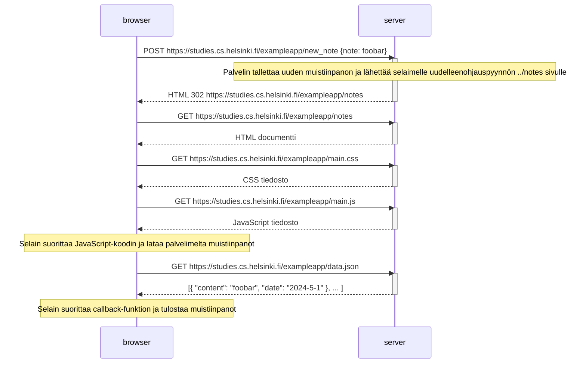

```mermaid
sequenceDiagram
    participant browser
    participant server
    
    browser->>server: POST https://studies.cs.helsinki.fi/exampleapp/new_note {note: foobar}
    activate server
    Note over server: Palvelin tallettaa uuden muistiinpanon ja lähettää selaimelle uudelleenohjauspyynnön ../notes sivulle
    server-->>browser: HTML 302 https://studies.cs.helsinki.fi/exampleapp/notes
    deactivate server
    
    browser->>server: GET https://studies.cs.helsinki.fi/exampleapp/notes
    activate server
    server-->>browser: HTML documentti
    deactivate server

    browser->>server: GET https://studies.cs.helsinki.fi/exampleapp/main.css
    activate server
    server-->>browser: CSS tiedosto
    deactivate server
    
    browser->>server: GET https://studies.cs.helsinki.fi/exampleapp/main.js
    activate server
    server-->>browser: JavaScript tiedosto
    deactivate server
    
    Note over browser: Selain suorittaa JavaScript-koodin ja lataa palvelimelta muistiinpanot
    
    browser->>server: GET https://studies.cs.helsinki.fi/exampleapp/data.json
    activate server
    server-->>browser: [{ "content": "foobar", "date": "2024-5-1" }, ... ]
    deactivate server    

    Note over browser: Selain suorittaa callback-funktion ja tulostaa muistiinpanot 
```